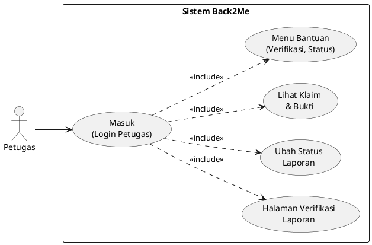

# Use Case Petugas – Back2Me

## 1. Use Case Diagram

---

## 2. Deskripsi Use Case

### 2.1 Masuk (Login Petugas)
- **Aktor utama**: Petugas
- **Tujuan**: Mengakses modul verifikasi laporan dan moderasi.
- **Prakondisi**: Akun petugas sudah dibuat oleh SuperAdmin.
- **Pasca-kondisi**: Petugas berada di dashboard atau daftar laporan.
- **Alur utama**:
  1. Petugas membuka halaman login.
  2. Petugas mengisi email dan password.
  3. Sistem memvalidasi kredensial dan role (`petugas`).
  4. Jika valid, sistem mengarahkan ke halaman laporan Back2Me khusus petugas.

### 2.2 Halaman Verifikasi Laporan
- **Aktor utama**: Petugas
- **Tujuan**: Melihat daftar laporan yang perlu ditinjau (termasuk yang diklaim).
- **Prakondisi**: Petugas sudah login.
- **Pasca-kondisi**: Daftar laporan tampil dengan filter status dan tipe.
- **Alur utama**:
  1. Petugas membuka menu laporan.
  2. Sistem menampilkan daftar laporan dengan status `pending`, `diproses`, `ditolak`, `selesai`, atau `expired`.
  3. Petugas mem-filter laporan berdasarkan status/tipe/kategori jika diperlukan.
  4. Petugas memilih satu laporan untuk melihat detail.

### 2.3 Lihat Klaim & Bukti
- **Aktor utama**: Petugas
- **Tujuan**: Memeriksa klaim dan bukti kepemilikan yang diajukan user.
- **Prakondisi**:
  - Petugas sudah login.
  - Laporan memiliki klaim aktif (status `diproses` dan field claimed_by terisi).
- **Pasca-kondisi**: Petugas memahami apakah klaim layak diterima atau ditolak.
- **Alur utama**:
  1. Petugas membuka detail laporan yang berstatus `diproses`.
  2. Sistem menampilkan informasi pelapor, pengklaim, catatan klaim, dan foto bukti.
  3. Petugas meninjau informasi dan bukti yang ada.

### 2.4 Ubah Status Laporan
- **Aktor utama**: Petugas
- **Tujuan**: Memoderasi laporan, misalnya menandai sebagai selesai, ditolak, atau expired.
- **Prakondisi**: Petugas sudah login dan memiliki hak akses (`role:petugas|superadmin`).
- **Pasca-kondisi**: Status laporan berubah sesuai keputusan petugas dan tercatat di sistem.
- **Alur utama**:
  1. Petugas membuka detail laporan.
  2. Petugas memilih status baru: `pending`, `diproses`, `selesai`, `ditolak`, atau `expired`.
  3. Sistem memvalidasi perubahan status.
  4. Sistem menyimpan perubahan status dan dapat menampilkan pesan sukses.
- **Alur alternatif**:
  - 2a. Status yang dipilih tidak valid → sistem menolak dan menampilkan pesan error.

### 2.5 Menu Bantuan (Verifikasi & Status)
- **Aktor utama**: Petugas
- **Tujuan**: Memberikan panduan singkat mengenai aturan verifikasi dan arti setiap status laporan.
- **Prakondisi**: Petugas membuka halaman bantuan dari modul Back2Me.
- **Pasca-kondisi**: Petugas memahami alur kerja verifikasi dan kebijakan moderasi.
- **Alur utama**:
  1. Petugas memilih menu "Bantuan".
  2. Sistem menampilkan informasi: definisi status (pending/diproses/selesai/ditolak/expired), contoh kasus klaim yang valid/tidak valid, dan langkah-langkah mengubah status.
