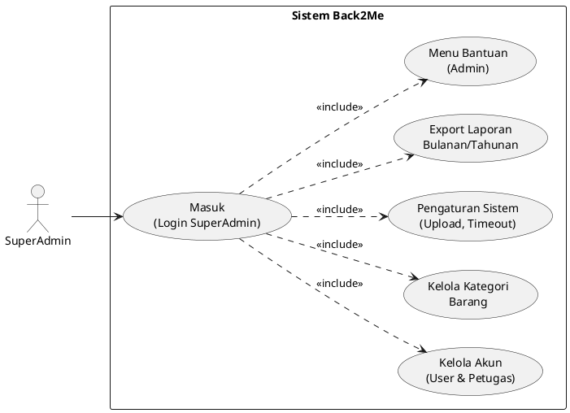

# Use Case SuperAdmin – Back2Me

## 1. Use Case Diagram

---

## 2. Deskripsi Use Case

### 2.1 Masuk (Login SuperAdmin)
- **Aktor utama**: SuperAdmin
- **Tujuan**: Mengakses seluruh fitur administrasi Back2Me.
- **Prakondisi**: Akun SuperAdmin terdaftar di sistem.
- **Pasca-kondisi**: SuperAdmin berada di dashboard administrasi.
- **Alur utama**:
  1. SuperAdmin membuka halaman login.
  2. Mengisi email dan password.
  3. Sistem memvalidasi kredensial dan mengecek role `superadmin`.
  4. Jika valid, sistem mengarahkan ke halaman admin Back2Me.

### 2.2 Kelola Akun (User & Petugas)
- **Aktor utama**: SuperAdmin
- **Tujuan**: Mengelola akun user dan petugas (buat, ubah, ban/unban, reset password, hapus).
- **Prakondisi**: SuperAdmin sudah login.
- **Pasca-kondisi**: Data akun di tabel users terbarui sesuai aksi.
- **Alur utama**:
  1. SuperAdmin membuka menu "Kelola User".
  2. Sistem menampilkan daftar user dengan pagination dan role.
  3. SuperAdmin dapat:
     - Menambah user baru (isi nama, email, role, password).
     - Mengubah nama/role user.
     - Mengaktifkan atau menonaktifkan (ban) user.
     - Mereset password user ke nilai default (misalnya `password123`).
     - Menghapus user tertentu.
  4. Sistem memvalidasi input dan menyimpan perubahan.
- **Alur alternatif**:
  - 3e. SuperAdmin mencoba menghapus akun dirinya sendiri → sistem menolak dan menampilkan pesan kesalahan.

### 2.3 Kelola Kategori Barang
- **Aktor utama**: SuperAdmin
- **Tujuan**: Menambah, mengubah, atau menghapus kategori barang.
- **Prakondisi**: SuperAdmin sudah login.
- **Pasca-kondisi**: Data kategori di tabel categories terbarui.
- **Alur utama**:
  1. SuperAdmin membuka menu "Kategori".
  2. Sistem menampilkan daftar kategori.
  3. SuperAdmin dapat:
     - Menambah kategori baru (nama + deskripsi).
     - Mengubah nama/deskripsi kategori.
     - Menghapus kategori yang tidak dipakai.
  4. Sistem memvalidasi (nama unik) dan menyimpan perubahan.

### 2.4 Pengaturan Sistem (Upload, Timeout)
- **Aktor utama**: SuperAdmin
- **Tujuan**: Mengatur parameter global sistem seperti batas ukuran upload, jumlah file, masa klaim, dan auto close.
- **Prakondisi**: SuperAdmin sudah login.
- **Pasca-kondisi**: Nilai konfigurasi tersimpan (misalnya di cache) dan dipakai oleh modul Back2Me.
- **Alur utama**:
  1. SuperAdmin membuka menu "Pengaturan".
  2. Sistem menampilkan form pengaturan: `max_upload_size`, `max_upload_files`, `claim_timeout_days`, `auto_close_days`.
  3. SuperAdmin mengubah nilai sesuai kebijakan.
  4. Sistem memvalidasi rentang nilai (misal ukuran upload 1–10MB, timeout 1–365 hari, auto close 30–365 hari).
  5. Sistem menyimpan pengaturan secara permanen (Cache::forever) dan menampilkan pesan sukses.

### 2.5 Export Laporan Bulanan/Tahunan
- **Aktor utama**: SuperAdmin
- **Tujuan**: Mengunduh rekap laporan Back2Me dalam format CSV untuk kebutuhan laporan atau audit.
- **Prakondisi**: SuperAdmin sudah login.
- **Pasca-kondisi**: File CSV terunduh berisi statistik dan detail laporan.
- **Alur utama (Export Bulanan)**:
  1. SuperAdmin membuka menu "Export Laporan".
  2. Memilih tahun dan bulan.
  3. Sistem mengambil data laporan pada periode tersebut.
  4. Sistem menghitung statistik (total, pending, diproses, selesai, ditolak).
  5. Sistem membuat file CSV dengan header, statistik, dan detail laporan.
  6. Sistem mengirim file CSV ke browser untuk diunduh.
- **Alur utama (Export Tahunan)**:
  1. SuperAdmin memilih tahun saja.
  2. Sistem mengambil data laporan selama 1 tahun.
  3. Sistem menghitung statistik dan breakdown per bulan.
  4. Sistem membuat file CSV tahunan dan mengirim ke browser.

### 2.6 Menu Bantuan (Admin)
- **Aktor utama**: SuperAdmin
- **Tujuan**: Menyediakan dokumentasi singkat mengenai fungsi-fungsi administrasi.
- **Prakondisi**: SuperAdmin membuka halaman bantuan admin.
- **Pasca-kondisi**: SuperAdmin memahami alur pengelolaan user, kategori, pengaturan, dan export.
- **Alur utama**:
  1. SuperAdmin memilih menu "Bantuan Admin".
  2. Sistem menampilkan penjelasan singkat tiap menu admin dan contoh penggunaan.
