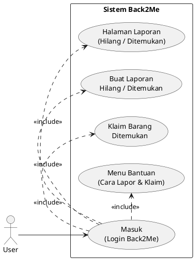

# Use Case User – Back2Me

## 1. Use Case Diagram

---

## 2. Deskripsi Use Case

### 2.1 Masuk (Login Back2Me)
- **Aktor utama**: User
- **Tujuan**: User dapat mengakses fitur Back2Me sesuai perannya.
- **Prakondisi**: Akun sudah terdaftar di sistem.
- **Pasca-kondisi**: User berada di dashboard / halaman laporan.
- **Alur utama**:
  1. User membuka halaman login.
  2. User mengisi email dan password.
  3. Sistem memvalidasi kredensial.
  4. Jika benar, sistem mengarahkan ke halaman laporan Back2Me.
- **Alur alternatif**:
  - 3a. Email/password salah → sistem menampilkan pesan error.

### 2.2 Melihat Halaman Laporan (Hilang / Ditemukan)
- **Aktor utama**: User
- **Tujuan**: User dapat melihat daftar laporan barang hilang dan ditemukan.
- **Prakondisi**: User sudah login.
- **Pasca-kondisi**: Daftar laporan tampil dengan filter dan pencarian.
- **Alur utama**:
  1. User membuka menu laporan Back2Me.
  2. Sistem menampilkan daftar laporan terbaru (hilang & ditemukan).
  3. User dapat memfilter berdasarkan kategori, status, lokasi, dan kata kunci.
  4. User memilih salah satu laporan untuk melihat detail.

### 2.3 Buat Laporan Hilang / Ditemukan
- **Aktor utama**: User (role `user`)
- **Tujuan**: Melaporkan barang hilang atau barang yang ditemukan.
- **Prakondisi**: User sudah login dan bukan role `petugas`.
- **Pasca-kondisi**: Laporan baru tersimpan dengan status awal `pending`.
- **Alur utama**:
  1. User membuka menu "Buat Laporan".
  2. User memilih tipe laporan: `hilang` atau `ditemukan`.
  3. User mengisi judul, kategori, deskripsi, lokasi.
  4. User mengunggah 0–5 foto barang (maks 5MB per foto).
  5. User mengirim formulir.
  6. Sistem memvalidasi data dan menyimpan laporan dengan status `pending`.
- **Alur alternatif**:
  - 4a. Ukuran atau jumlah file melebihi batas → sistem menampilkan pesan error.

### 2.4 Klaim Barang Ditemukan
- **Aktor utama**: User (pengklaim)
- **Tujuan**: Mengklaim bahwa barang yang ditemukan adalah miliknya.
- **Prakondisi**:
  - User sudah login dengan role `user`.
  - Laporan bertipe `ditemukan` dan belum diklaim user lain.
- **Pasca-kondisi**: Data klaim tercatat, status laporan berubah ke `diproses`.
- **Alur utama**:
  1. User membuka detail laporan barang ditemukan.
  2. User mengklik tombol "Klaim Barang Ini".
  3. User mengunggah minimal 1 foto bukti kepemilikan dan mengisi catatan klaim.
  4. Sistem memvalidasi bukti dan catatan (panjang minimal, ukuran file).
  5. Sistem menyimpan data klaim (claimed_by, claimed_at, bukti, catatan) dan mengubah status menjadi `diproses`.
  6. Sistem mengirim notifikasi ke pelapor dan/atau petugas.
- **Alur alternatif**:
  - 2a. User mencoba klaim laporan miliknya sendiri → sistem menolak dan menampilkan pesan kesalahan.
  - 5a. Laporan sudah diklaim user lain atau sudah `expired` → sistem menampilkan pesan kesalahan.

### 2.5 Menu Bantuan (Cara Lapor & Klaim)
- **Aktor utama**: User
- **Tujuan**: Membantu user memahami cara menggunakan fitur login, pelaporan, dan klaim.
- **Prakondisi**: User membuka halaman bantuan dari menu Back2Me.
- **Pasca-kondisi**: User mengetahui langkah-langkah menggunakan sistem.
- **Alur utama**:
  1. User memilih menu "Bantuan" / "Help" di modul Back2Me.
  2. Sistem menampilkan panduan singkat: cara login, cara membuat laporan, cara klaim barang, dan cara konfirmasi penerimaan.
